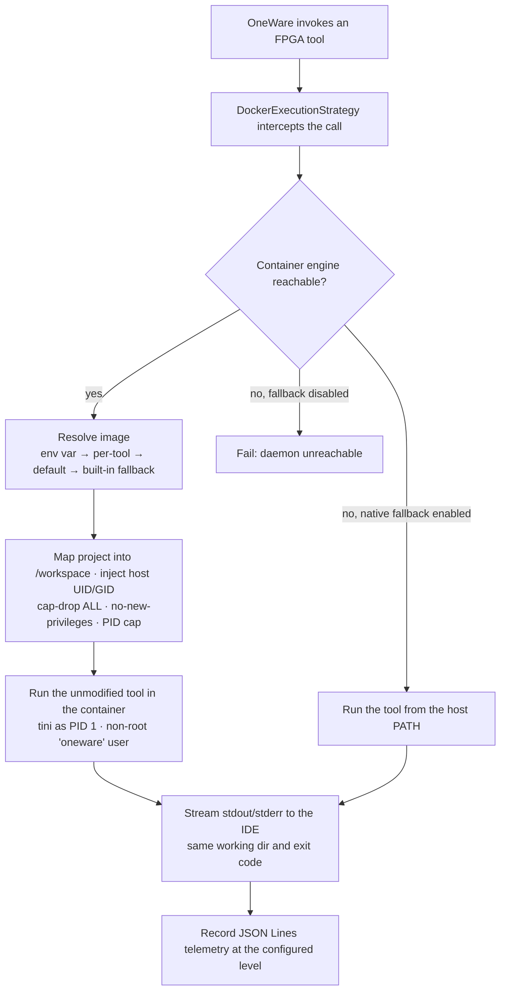

# OneWare Container Extension

[](https://github.com/FEntwumS/FEntwumS.ContainerExtension/actions/workflows/dotnet.yml)
[](License.md)


A [OneWare Studio](https://github.com/one-ware/OneWare) plugin that runs FPGA toolchains (GHDL, Yosys,
nextpnr, gmpack, Icarus, Verilator, SymbiYosys) inside containers without changing the user's workflow.
It intercepts tool execution, maps the project into a container, runs the unmodified tool, and streams
output back to the IDE, so a build behaves identically across machines with no host toolchain install.

Developed as part of the Master's thesis *"Design and Implementation of a Modular Architecture for the
Transparent Integration of Containerized Execution Environments for Heterogeneous Open-Source Binaries in
OneWare Studio"* by [Mert Torun](https://mtorun0x7cd.com) at TH Köln.


## Installation

- **From OneWare Studio:** open Extensions, search for "Container Extension", and install. The plugin
  ships as a managed `net10.0` assembly; OneWare provides the runtime.
- **Side-load a local build:** publish the plugin and copy it into the OneWare plugins directory
  (`~/OneWareStudio/Packages/Plugins/` on Linux/macOS). See [docs/articles/getting-started.md](docs/articles/getting-started.md).

A running container engine (Docker, Podman, OrbStack, or Colima) is required for containerized execution.

## Repository layout

Each top-level directory carries its own README with the detail; this is the map.

| Path | Contents |
|---|---|
| [`src/`](src/README.md) | The plugin assemblies. `ContainerExtension` is the core: `IToolExecutionStrategy`/`DockerExecutionStrategy`, the registry client, settings, telemetry, and the Avalonia Docker dashboard (`net10.0`, `IsAotCompatible`, source-generated JSON and regex). `ContainerBenchmarkHarness` is a headless driver used by the benchmarking suite and smoke runner. |
| [`tests/`](tests/README.md) | `ContainerExtension.UnitTests` (xUnit: validators, command building, path mapping, telemetry, registry parsing, SSRF guards, plus gated container E2E), `integration` (HDL fixtures and shell smoke runners), and `benchmarking_suite` (the cross-platform evaluation pipeline). |
| [`examples/`](examples/README.md) | Eight self-contained GateMate FPGA designs in VHDL and Verilog that drive the full synthesis → place-and-route → bitstream and simulation flow through the container; also the integration-test corpus. |
| [`docker/`](docker/README.md) | Build inputs for the hardened `fentwums/oss-cad-suite` toolchain image: the digest-pinned `Dockerfile`, `build_oss_cad_suite.sh`, and `pull_all_images.sh`. |
| [`docs/`](docs/articles) | DocFX site sources — prose guides under `articles/` and the generated API reference. See [Documentation](#documentation) to build and view the HTML. |

The runtime design (interception, the container lifecycle, the hybrid strategy) is summarized under
[Execution model](#execution-model) and detailed in [docs/articles/architecture.md](docs/articles/architecture.md).

## Execution model

The plugin coordinates execution through a hybrid strategy:



- **Containerized (default):** pulls and runs the toolchain image, injecting the host UID/GID and running
  as a non-root `oneware` user so output files are not root-owned. `tini` runs as PID 1 to reap
  children and forward signals.
- **Native fallback:** if the daemon is unreachable and `Allow Native Fallback` is enabled, the tool is
  located on the host `PATH` and run natively so work is not blocked.
- **Telemetry:** execution records are written as JSON Lines with a configurable level (`Off`,
  `Errors Only`, `Info`, `Verbose`) and retention. See [docs/articles/telemetry.md](docs/articles/telemetry.md).

## Security

- Non-root container execution with host UID/GID injection; `tini` as PID 1. The default
  (non-privileged) path drops all capabilities (`--cap-drop=ALL`), forbids privilege escalation
  (`--security-opt no-new-privileges`), and caps the task count as a fork-bomb backstop.
- Host paths that escape the mounted workspace are remapped to an in-workspace sentinel rather than
  their real location; an explicit device/library allowlist is the only pass-through. The behaviour is
  pinned by an adversarial path-containment test corpus that runs in CI.
- Mount allow-listing rejects binds of critical host paths (`/etc`, `/proc`, `/sys`, the Docker socket, …).
- The registry client is HTTPS-only, scopes forwarded credentials to the matching host, and rejects
  references that resolve to loopback or internal addresses (SSRF defense).
- Supply chain: `NuGetAudit`, an SBOM and OIDC build attestations on releases, and CodeQL plus Trivy
  scans in CI. The runtime image pins its base by digest and verifies the toolchain tarball against a
  committed SHA-256 (fail-closed); image integrity is anchored on these committed digests and the
  per-run recorded image digest. Provenance is TLS-trusted, not yet cosign-signed.

## Supported container runtimes

| Runtime | Endpoint | Notes |
|---|---|---|
| Docker | `/var/run/docker.sock`, `~/.docker/run/docker.sock` | Probed first |
| Podman | `/run/user/{uid}/podman/podman.sock`, podman-machine | Rootless |
| OrbStack / Colima | per-runtime sockets | Probed via a priority list |
| Custom | `Custom Daemon Socket` setting | Overrides probing |

On Windows the daemon is reached over the named pipe; the connection path is validated before use.

## Building and testing

```bash
git clone --recurse-submodules https://github.com/FEntwumS/FEntwumS.ContainerExtension.git
cd FEntwumS.ContainerExtension

dotnet format OneWare.ContainerExtension.slnx --verify-no-changes
dotnet build  OneWare.ContainerExtension.slnx -warnaserror -c Release
dotnet test   OneWare.ContainerExtension.slnx -c Release

# Optional: headless integration smoke (requires a container engine)
cd tests/integration && ./run_all.sh
```

The container E2E tests are skipped in CI (Docker Hub rate limits and image-pull flakiness); they run
locally when a daemon and the toolchain image are present.

## Documentation

Prose guides live under [docs/articles](docs/articles): getting started, configuration, architecture,
telemetry, evaluation, and limitations. The full site bundles those guides with an API reference
generated from the source by [DocFX](https://dotnet.github.io/docfx/):

```bash
dotnet tool install -g docfx     # once
docfx docs/docfx.json --serve    # build and serve at http://localhost:8080
```

`docfx build docs/docfx.json` produces the static HTML under `docs/_site/` without serving.

## Citation

If you use this software, cite it via [CITATION.cff](CITATION.cff).

## License

[MIT](License.md) © 2025–2026 [Mert Torun](https://mtorun0x7cd.com)
