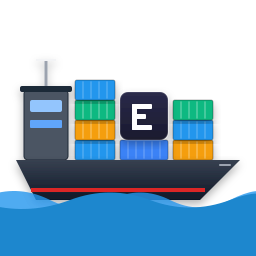

# OneWare Container Extension

A **OneWare Studio** plugin that enables transparent, containerized execution of FPGA toolchains. Built on a modernized infrastructure paradigm.
Developed as part of the Master's Thesis: *"Design and Implementation of a Modular Architecture for the Transparent Integration of Containerized Execution Environments for Heterogeneous Open-Source Binaries in OneWare Studio"* by **[Mert Torun](https://mtorun0x7cd.com)** at TH Köln.



## Hardening & Security

This extension adheres to hardened security practices to eliminate "Environment Drift" and lateral escape risks:
- **Zero-Privilege Containers**: Automatically injects Host UID/GID and enforces `USER oneware` execution to drop root privileges entirely.
- **PID 1 Signal Management**: Wraps toolchains with `tini` to ensure faultless zombie process reaping and propagation of kill signals.
- **Deterministic Dependencies**: Pipeline guarded by `<NuGetAudit>`, SLSA SBOM generation, and GitHub CodeQL SAST scanning.
- **Immutable Provenance**: GitHub Releases embed cryptographic OIDC build-attestations.

## Architecture Layers & Native-AOT Compatibility

This repository is structured into isolated domains adhering to strict Native-AOT compile-time guarantees:
- **ContainerExtension (Module Core)**: Built on C# 13, targeting .NET 10. Completely reflection-free. Utilizes static, source-generated serialization via `JsonSerializerContext` and regex source generators to eliminate dynamic code generation.
- **ContainerBenchmarkHarness (Execution Harness)**: Provides developer-side benchmark execution profiles and telemetry stress testing capabilities.
- **ContainerExtension.UnitTests (Testing boundary)**: Tests and verifies settings validator logic, regexes, and pipeline streaming parsing.
- **Local Headless EDA Tests (`local_tests/`)**: A 15-phase Bash integration test suite verifying end-to-end containerized EDA workflows (GHDL, Icarus, Verilator, Yosys, NextPNR) directly against the `oss-cad-suite` Docker image.

## Hybrid Strategy & Execution Modes

This extension implements the **Hybrid Strategy Pattern** to coordinate tool execution dynamically based on environment state and user preferences:
- **Containerized Mode (Default)**: Automatically pulls, executes, and monitors the required toolchains inside isolated, rootless container instances (supporting Docker Desktop, Podman, Colima, and OrbStack).
- **Dynamic Native Fallback**: If the Docker daemon is offline or unreachable, the execution engine can dynamically fallback to locate and execute native binaries installed on the host's `PATH` (controlled by the `Allow Native Fallback` setting) to prevent workspace disruption.
- **Observability Log Filtering**: Granular telemetry control settings (`Off`, `Errors Only`, `Verbose`) allow users to filter execution records, dropping successful telemetry in `Errors Only` mode, or removing performance stack traces on lower log levels to optimize local disk writes.

## Performance & Security Optimizations

- **Compile-Time Engineering**: Static dependencies, source-generated JSON serialize/deserialize, and static regular expressions.
- **Hardware Intrinsics**: SIMD-based white-space detection and search values checking for container name validation.
- **Unmanaged Memory**: Modern `[LibraryImport]` structures, safe OS process token extractions, and SafeHandle structures.
- **Pipeline Architectures**: System.IO.Pipelines-driven stream logging to prevent large object heap (LOH) fragmentation.
- **Defensive Cryptography**: Fixed-time credentials comparison and zero-memory wipes for decrypted credentials.
- **Zero-Allocation Observability**: Structured logs, pre-compiled JSON contexts, and OpenTelemetry Activity tracing.
- **Avalonia Rendering**: Double-buffered sparkline drawing using WriteableBitmap memory copies.

## Quick Start

```bash
# Clone (with submodules)
git clone --recurse-submodules https://github.com/FEntwumS/FEntwumS.ContainerExtension.git

# Verify Formatting & Determinism
dotnet format --verify-no-changes
dotnet build -warnaserror

# Execute C# Unit Tests
dotnet test --verbosity normal

# Execute Headless EDA Integration Tests
cd local_tests && ./run_all.sh
```

## Supported Container Runtimes

| Runtime | Protocol | Notes |
| --- | --- | --- |
| Docker Desktop | `/var/run/docker.sock` | Recommended, probed first |
| Podman | `/run/user/{uid}/podman/podman.sock` | Rootless enforcement |
| OrbStack / Colima | Custom Sockets | Probed via priority list |

## API Documentation

Auto-generated API documentation is available via [DocFX](https://dotnet.github.io/docfx/).

## License

[MIT](License.md) (C) 2025 - 2026 [Mert Torun](https://mtorun0x7cd.com)
