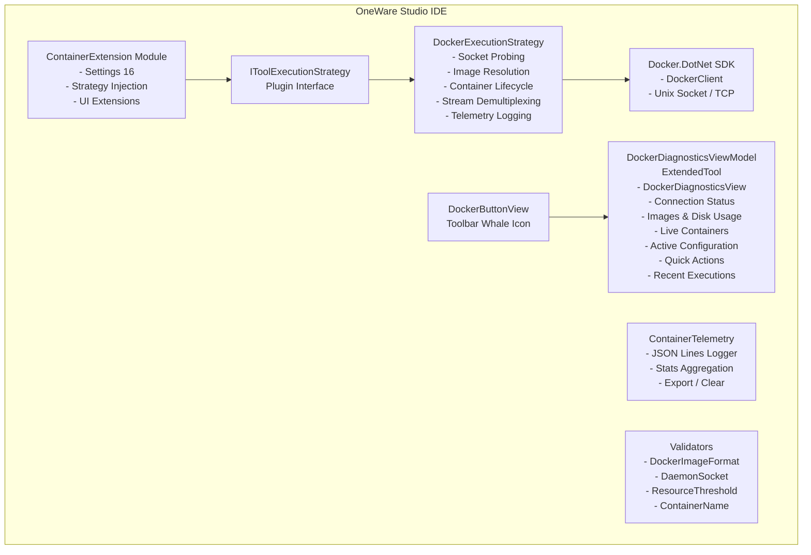

# Architecture Overview

The OneWare Container Extension implements the **Hybrid Strategy Pattern** for transparent containerized execution of FPGA toolchains within OneWare Studio.

## Component Diagram



## Source Files

| File | Purpose |
| ------ | --------- |
| `ContainerExtensionModule` | Registers 16 settings, injects Docker strategy, dockable DataTemplate, health check |
| `DockerExecutionStrategy` | Full container lifecycle: socket probing, auto-pull, stream demux, telemetry |
| `DockerDiagnosticsView` | Docker Desktop-style live dashboard UserControl |
| `DockerDiagnosticsViewModel` | ExtendedTool docking adapter |
| `DockerDiagnosticsWindow` | Standalone Window wrapper (popup fallback) |
| `DockerButtonView` | Toolbar whale icon - opens dockable dashboard |
| `ContainerTelemetry` | JSON Lines logger with stats and export |

## Image Resolution Hierarchy

```text
1. ONEWARE_DOCKER_IMAGE env var        (highest - CI/CD override)
2. ContainerImage_{tool} per-tool      (settings UI)
3. ContainerExtension_DefaultImage     (global setting)
4. hdlc/ghdl:yosys                     (hardcoded fallback)
```

## Container Lifecycle

```text
ResolveImage -> EnsureImage (pull if needed) -> BuildContainerParameters
    -> CreateContainer -> AttachStreams -> StartContainer
    -> DrainLines (demultiplex stdout/stderr)
    -> WaitContainer -> Log Telemetry -> Cleanup
```

## Docking System Integration

The dashboard integrates with OneWare Studio's dock infrastructure via the `ExtendedTool` base class:

1. **`DockerDiagnosticsViewModel`** extends `ExtendedTool` with `CanFloat = true` and `CanPin = true`
2. **`FuncDataTemplate`** inserted at index 0 in `Application.DataTemplates` to bypass OneWare's `ViewLocator` (which requires parameterless constructors)
3. **`DockerButtonView`** uses `IMainDockService.Show(vm, DockShowLocation.Bottom)` with a singleton ViewModel to prevent duplicate tabs
4. **`DockerDiagnosticsWindow`** serves as a fallback standalone popup if the dock service is unavailable
