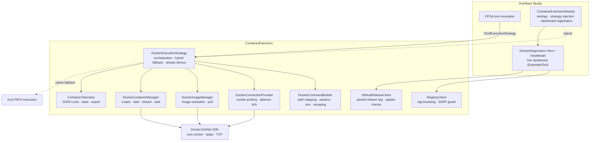

# Architecture Overview

The OneWare Container Extension implements the **Hybrid Strategy Pattern** for transparent containerized execution of FPGA toolchains within OneWare Studio.

## Component Diagram



## Source Files

| File | Purpose |
| ------ | --------- |
| `ContainerExtensionModule` | Registers the engine settings (plus per-tool image overrides), injects the Docker strategy, dockable DataTemplate, health check |
| `DockerExecutionStrategy` | Full container lifecycle: socket probing, auto-pull, stream demux, telemetry |
| `DockerDiagnosticsView` | Docker Desktop-style live dashboard UserControl |
| `DockerDiagnosticsViewModel` | `ExtendedTool` docking adapter for the dashboard |
| `DockerCommandBuilder` | Host-to-container path mapping, parameter assembly, `.env` parsing, shell escaping |
| `ContainerTelemetry` | JSON Lines logger with stats and export |

## Image Resolution Hierarchy

```text
1. ONEWARE_DOCKER_IMAGE env var        (highest - CI/CD override)
2. ContainerImage_{tool} per-tool      (settings UI)
3. ContainerExtension_DefaultImage     (global setting; defaults to fentwums/oss-cad-suite:latest)
4. DefaultToolImages[tool]             (built-in per-tool map)
5. hdlc/ghdl:yosys                     (hardcoded fallback)
```

## Container Lifecycle

```text
ResolveImage -> EnsureImage (pull if needed) -> BuildContainerParameters
    -> CreateContainer -> AttachStreams -> StartContainer
    -> DrainLines (demultiplex stdout/stderr)
    -> WaitContainer -> Log Telemetry -> Cleanup
```

## Docking System Integration

The dashboard integrates with OneWare Studio's dock infrastructure via the `ExtendedTool` base class:

1. **`DockerDiagnosticsViewModel`** extends `ExtendedTool` with `CanFloat = true` and `CanPin = true`
2. **`FuncDataTemplate`** inserted at index 0 in `Application.DataTemplates` to bypass OneWare's `ViewLocator` (which requires parameterless constructors)
3. **`IMainDockService.RegisterLayoutExtension<DockerDiagnosticsViewModel>(DockShowLocation.RightPinned)`** registers the default layout slot
4. An **`IApplicationCommandService`** command and a **`View > Tool Windows > Container Dashboard`** menu item (registered via `IWindowService`) both open the singleton ViewModel via `IMainDockService.Show(vm, DockShowLocation.RightPinned)`, preventing duplicate tabs
